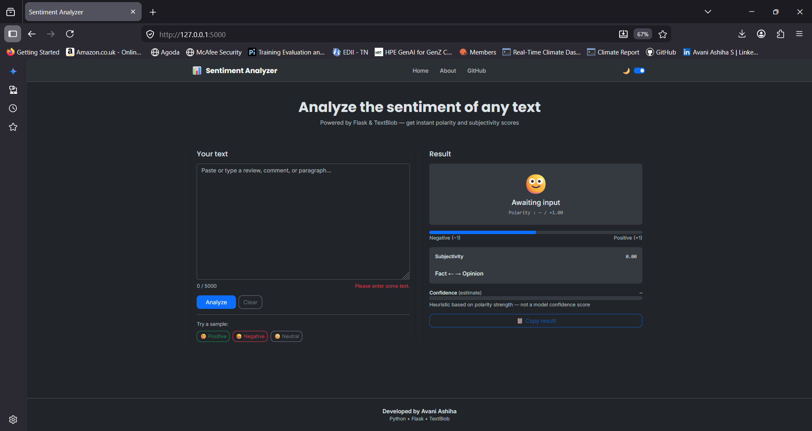

````markdown
# 😊 Sentiment Analysis Web Application

> A modern Natural Language Processing (NLP) web application that analyzes user-entered text and classifies it as **Positive**, **Negative**, or **Neutral** using **TextBlob** and **Flask**.


---

## ⭐ Key Highlights

- Built using Python and Flask
- NLP-based Sentiment Analysis using TextBlob
- Interactive and responsive web interface
- Real-time sentiment prediction
- Displays polarity and subjectivity scores
- Interactive sentiment gauge
- Light/Dark mode support
- Character counter and sample text buttons
- Clean, modular project structure

---

# 📌 Project Overview

Sentiment Analysis is one of the most widely used applications of Natural Language Processing (NLP). This project allows users to enter any sentence or paragraph and instantly receive a sentiment analysis report.

The application performs:

- 😊 Sentiment Classification
- 📊 Polarity Analysis
- 📈 Subjectivity Analysis
- 🎯 Estimated Confidence Visualization

The project demonstrates the integration of **Python**, **Flask**, and **TextBlob** to build an interactive NLP web application with a clean and responsive user interface.

---

# 🚀 Features

### Sentiment Analysis

- Positive 😊
- Negative 😞
- Neutral 😐

### Text Analysis

- Polarity Score
- Subjectivity Score
- Estimated Confidence

### User Interface

- Modern Dashboard
- Responsive Design
- Light/Dark Theme
- Character Counter
- Sample Input Buttons
- Copy Result Button
- Analysis Timestamp

---

# 🛠️ Technologies Used

| Category | Technologies |
|----------|--------------|
| Programming Language | Python 3.11 |
| Backend | Flask |
| NLP Library | TextBlob |
| Frontend | HTML5 |
| Styling | CSS3 |
| Scripting | JavaScript |
| UI Framework | Bootstrap 5 |

---

# 📂 Project Structure

```text
Sentiment_Analysis_Web_App/
│
├── app.py
├── requirements.txt
├── README.md
├── .gitignore
│
├── src/
│   ├── sentiment.py
│   ├── validation.py
│   ├── text_preprocessing.py
│   └── utils.py
│
├── static/
│   ├── css/
│   │      style.css
│   ├── js/
│   │      script.js
│   └── images/
│
├── templates/
│   ├── index.html
│   ├── about.html
│   └── result.html
│
├── screenshots/
│   ├── home.png
│   ├── positive_result.png
│   ├── negative_result.png
│   └── neutral_result.png
│
└── reports/
    ├── Project_Report.pdf
    └── Project_Presentation.pptx
```

---

# ⚙️ Workflow

```text
User Input
     │
     ▼
Input Validation
     │
     ▼
Flask Backend
     │
     ▼
TextBlob Processing
     │
     ▼
Calculate Polarity
     │
     ▼
Calculate Subjectivity
     │
     ▼
Classify Sentiment
     │
     ▼
Display Results
```

---

# 📊 Sentiment Logic

### Polarity

| Score | Sentiment |
|--------|-----------|
| > 0 | 😊 Positive |
| = 0 | 😐 Neutral |
| < 0 | 😞 Negative |

### Subjectivity

| Score | Interpretation |
|--------|----------------|
| 0.00 – 0.30 | Objective |
| 0.31 – 0.70 | Moderately Subjective |
| 0.71 – 1.00 | Highly Subjective |

---

# 📷 Application Screenshots

## 🏠 Home Page



## 😊 Positive Result


## 😞 Negative Result


## 😐 Neutral Result


---

# 💻 Installation

### Clone the Repository

```bash
git clone https://github.com/AA06-hash/Sentiment_Analysis_Web_App.git
```

### Navigate to the Project Directory

```bash
cd Sentiment_Analysis_Web_App
```

### Install Required Dependencies

```bash
pip install -r requirements.txt
```

### Download TextBlob Corpora

```bash
python -m textblob.download_corpora
```

### Run the Application

```bash
python app.py
```

Open your browser and visit:

```text
http://127.0.0.1:5000
```

---

# 🧪 Sample Inputs

### Positive

```text
I absolutely love this product. It exceeded my expectations and made my day.
```

### Negative

```text
This is the worst experience I have ever had. I am extremely disappointed.
```

### Neutral

```text
The meeting starts at 10:00 AM tomorrow in the conference room.
```

---

# 📈 Future Enhancements

- Machine Learning-based Sentiment Classification
- Logistic Regression
- Naive Bayes
- Support Vector Machine (SVM)
- BERT Transformer Integration
- Multi-language Support
- Speech-to-Text Sentiment Analysis
- File Upload Support
- REST API Development
- Docker Deployment
- Cloud Deployment (Render, Railway, AWS)

---

# 📄 Deliverables

- ✅ Flask Web Application
- ✅ Python Source Code
- ✅ HTML/CSS/JavaScript Files
- ✅ Project Report (PDF)
- ✅ PowerPoint Presentation
- ✅ Screenshots
- ✅ README Documentation
- ✅ requirements.txt
- ✅ GitHub Repository

---

# ⚠️ Limitations

This project uses **TextBlob**, a lexicon-based sentiment analysis library. While it performs well for straightforward sentiment classification, it may not accurately interpret sarcasm, irony, or complex mixed-emotion statements. Future versions can leverage transformer-based language models such as **BERT** for improved contextual understanding and prediction accuracy.

---

# 👩‍💻 Author

**Avani Ashiha**

**B.Tech CSE (AI & DS)**

GitHub: https://github.com/AA06-hash

---

## ⭐ Support

If you found this project helpful, consider giving it a **Star ⭐** on GitHub.
````
